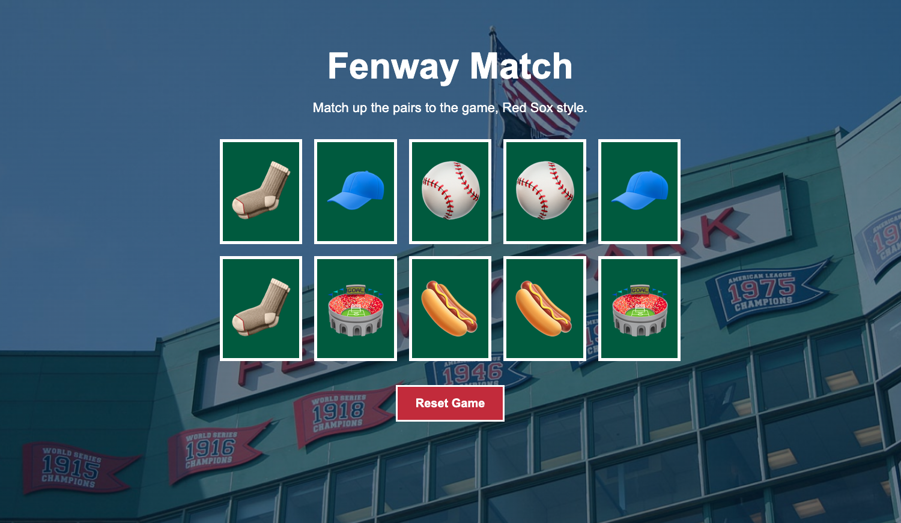

# ⚾ Fenway Match

Fenway Match is a baseball-themed card matching game inspired by Fenway Park and the Boston Red Sox. Players flip cards to find matching emoji pairs and try to clear the board by finding every match.

I built this project to practice JavaScript game logic, DOM manipulation, and event handling while creating a more complete visual experience around a classic matching game.

## 📸 Project Preview

## ✨ Features

- Flip cards to reveal hidden symbols
- Match identical emoji pairs
- Keep successfully matched cards revealed
- Continue playing until all pairs are found
- Fenway Park-inspired visual theme
- Responsive layout for different screen sizes

## 🛠️ Built With

- HTML5
- CSS3
- JavaScript

## 🧠 What I Learned

This project helped me strengthen my understanding of:

- Working with arrays in JavaScript
- Using event listeners for user interactions
- Manipulating elements in the DOM
- Tracking game state
- Comparing selected values
- Using conditional logic
- Adding and removing CSS classes dynamically
- Connecting JavaScript game logic to a visual interface
- Building responsive layouts

## 🎮 How It Works

The game begins with a set of cards placed face down. Each card contains an emoji that has one matching pair somewhere else on the board.

Select two cards to reveal their symbols. If the symbols match, the pair remains revealed. If they do not match, the cards are flipped back over so you can try again.

Keep matching pairs until you've cleared the board.

## 🎨 Design

The original matching game was redesigned around a Fenway Park theme, using a red color palette, green card accents inspired by the ballpark, and Fenway Park imagery to give the game its own visual identity.